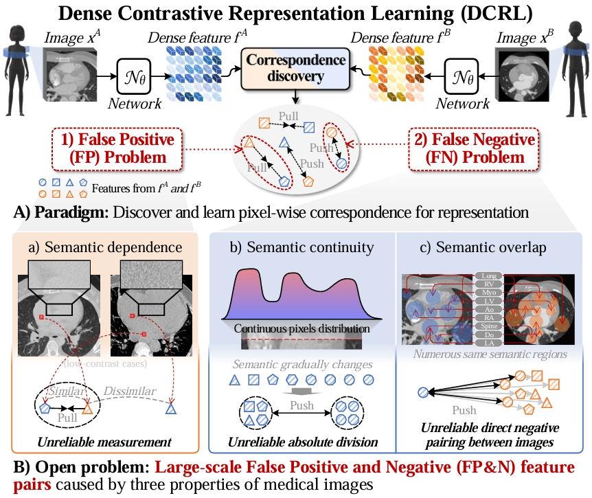

# Homeomorphism Prior for False Positive and Negative Problem in Medical Image Dense Contrastive Representation Learning

[News!!]**The paper has been accepted by [T-PAMI](https://ieeexplore.ieee.org/document/10879555) (IF:20.8)**

[NOTE!!]**This code is a journal extended version of the conference work of [GVSL](https://github.com/YutingHe-list/GVSL).**

Dense contrastive representation learning (DCRL), with its powerful dense posterior distribution learning ability, has greatly improved the learning efficiency for image dense prediction tasks, showing its great potential to reduce the large costs of medical image collection and dense annotation. However, the properties of medical images make unreliable correspondence discovery, bringing an open problem of large-scale false positive and negative (FP&N) feature pairs in DCRL. In this project, we propose GEoMetric vIsual deNse sImilarity (GEMINI) Learning  which embeds the homeomorphism prior to DCRL and enables a reliable correspondence discovery to learn an effective dense contrast under the condition of medical images' inherent topology. 

<p align="center"></p>

## Paper
This repository provides the official PyTorch implementation of GEMINI in the following papers:

**[Homeomorphism Prior for False Positive and Negative Problem in Medical Image Dense Contrastive Representation Learning](https://ieeexplore.ieee.org/document/10879555)**<br/> 
[Yuting He](https://yutinghe-list.github.io/), [Boyu Wang](https://sites.google.com/site/borriewang/), [Rongjun Ge](https://scholar.google.com/citations?user=v8K8HIkAAAAJ&hl=en), [Yang Chen](https://scholar.google.com/citations?user=LxjxwpgAAAAJ&hl=en), [Guanyu Yang*](https://cse.seu.edu.cn/2019/0103/c23024a257233/page.htm), [Shuo Li](http://www.digitalimaginggroup.ca/members/shuo.php)<br/>
IEEE Transactions on Pattern Analysis and Machine Intelligence <br/>

## Citation
If you use this code or use our pre-trained weights for your research, please cite our papers:
```
@ARTICLE{10879555,
  author={He, Yuting and Wang, Boyu and Ge, Rongjun and Chen, Yang and Yang, Guanyu and Li, Shuo},
  journal={IEEE Transactions on Pattern Analysis and Machine Intelligence}, 
  title={Homeomorphism Prior for False Positive and Negative Problem in Medical Image Dense Contrastive Representation Learning}, 
  year={2025},
  volume={},
  number={},
  pages={1-18},
  doi={10.1109/TPAMI.2025.3540644}}

```
```
@InProceedings{He_2023_CVPR,
    author    = {He, Yuting and Yang, Guanyu and Ge, Rongjun and Chen, Yang and Coatrieux, Jean-Louis and Wang, Boyu and Li, Shuo},
    title     = {Geometric Visual Similarity Learning in 3D Medical Image Self-Supervised Pre-Training},
    booktitle = {Proceedings of the IEEE/CVF Conference on Computer Vision and Pattern Recognition (CVPR)},
    month     = {June},
    year      = {2023},
    pages     = {9538-9547}
}
```

## Official implementation
- [Few-shot semi-supervised segmentation](https://github.com/YutingHe-list/GEMINI/tree/main/GEMINI_FS_Semi)
- [Self-supervised medical image pre-training]()

